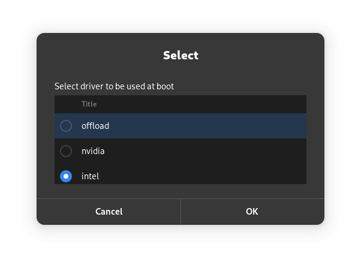

# Prime Helper
This is a collection of shell scripts and *.desktop files to be used with prime-select.  
Aka: suse-prime, prime-manager, optimus manager etc.  
To help users with older nVidia Optimus Laptops to easily switch between nvidia exclusive, intel exclusive or offload Optimus modes.  

Optimus systems with a nVidia GPU wihtout the GSP co-processor are usually those requireing special workaround on linux. (Pascal and older GPUs)

## Requirements
- prime-select / suse-prime / Optimus-Manager
- X11: Sorry no Wayland as prime-select does flip around X-Configfiles to do it's thing.
- bbswitch: for power managnement
- pkexec for gaphical sudo authentication

## Documentation
### prime-test
Test if prime-select is installed into the current system.  
If prime-select could not be found an error message will be shown.

### prime-toggle
Switches the driver from intel to nvidia or vise versa.  
Checks the current configured driver and will use the opposite.

### prime-boot
Set the gpu driver to be used at boot. This can be intel, nvidia or offload.  
The selection menu also pre-selects the current boot driver.  
This means you can also use this to investigate which driver is currently configured to be used at boot.

#### prime-i18n
Helper script to display localized messages by reading the content of $LANG.  
Supported languages are:
- English (Default)
- German